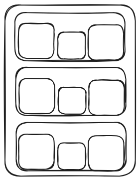
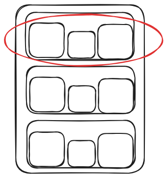
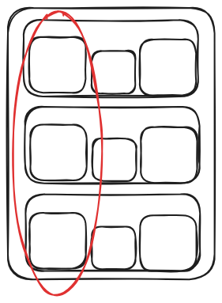
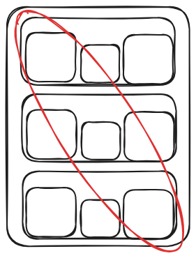
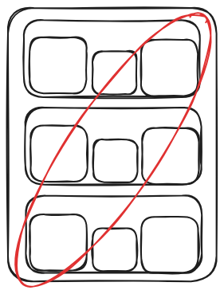

# Exercício JS 6

## 1. Ceverino tem uma estante com três compartimentos um em cima do outro. Cada compartimento comporta três caixas uma ao lado da outra. As caixas possuem duas características que o Ceverino sempre observa: cor da caixa e a numeração escrita nela. Sabendo disso, escolha uma estrutura de dados para representar a estante de Ceverino e um tipo de dado para representar a caixa.
**Exemplo ilustrativo da estante de Ceverino:**
<div align="center">
    
</div>

## 2. A partir do exercício 1, crie uma função que receba dois parâmetros:
- Estrutura que você escolheu no exercício 1
- Um número que representará o índice do compartimento da estante
## A função deve retornar:
- As informações de todas as caixas que estão no compartimento solicitado

**Exemplo ilustrativo das caixas da estante que serão retornadas, caso o primeira compartimento seja o solicitado:**
<div align="center">
    
</div>

## 3. A partir do exercício 1, crie uma função que receba dois parâmetros:
- Estrutura que você escolheu no exercício 1
- Um número que representará o índice da coluna dos compartimentos da estante
## A função deve retornar:
- As informações de todas as caixas que estão nos compartimentos na coluna solicitada

**Exemplo ilustrativo das caixas da estante que serão retornadas, caso a primeira coluna seja o solicitada:**
<div align="center">
    
</div>

## 4. A partir do exercício 1, crie uma função que receba dois parâmetros:
- Estrutura que você escolheu no exercício 1
## A função deve retornar:
- As informações de todas as caixas que estão na diagonal principal da estante

**Exemplo ilustrativo das caixas da estante que serão retornadas:**
<div align="center">
    
</div>

## 5. A partir do exercício 1, crie uma função que receba dois parâmetros:
- Estrutura que você escolheu no exercício 1
## A função deve retornar:
- As informações de todas as caixas que estão na diagonal secundária da estante

**Exemplo ilustrativo das caixas da estante que serão retornadas:**
<div align="center">
    
</div>

## 6. Crie uma função chamada **uniqueValues** que receba como parâmetro: 
- Uma lista de números
## A função deve retornar:
- A mensagem "O parâmetro deve ser uma lista!", caso o parâmetro **não** seja uma lista
- Uma lista com todos os números **sem** repetições, caso os parâmetros estejam no formato correto
- Uma lista vazia, caso a lista esteja vazia

**Exemplo:**
```JavaScript
const numbers = [1, 2, 3, 3, 2, 4, 0]

console.log(uniqueValues(numbers))
/* resultado no terminal deve ser:
[1, 2, 3, 4, 0]
*/

console.log(uniqueValues([]))
/* resultado no terminal deve ser:
[]
*/

console.log(uniqueValues(2))
/* resultado no terminal deve ser:
O parâmetro deve ser uma lista!
*/
```

## 7. Crie uma função chamada **innerJoin** que receba dois parâmetros: 
- Uma lista de números
- Uma lista de números
## A função deve retornar:
- A mensagem "O primeiro parâmetro deve ser uma lista!", caso o primeiro parâmetro **não** seja uma lista
- A mensagem "O segundo parâmetro deve ser uma lista!", caso o segundo parâmetro **não** seja uma lista
- Uma lista com todos os números que estão em ambas as listas, caso os parâmetros estejam no formato correto
- Uma lista vazia, caso não haja números que estão em ambas as listas

**Exemplo:**
```JavaScript
const numbers1 = [1, 2, 3, 3, 2, 4, 0]
const numbers2 = [1, 2, 3, 5, 10]

console.log(innerJoin(numbers1, numbers2))
/* resultado no terminal deve ser:
[1, 2, 3]
*/

console.log(innerJoin([], numbers2))
/* resultado no terminal deve ser:
[]
*/

console.log(innerJoin(2, numbers2))
/* resultado no terminal deve ser:
O primeiro parâmetro deve ser uma lista!
*/
```