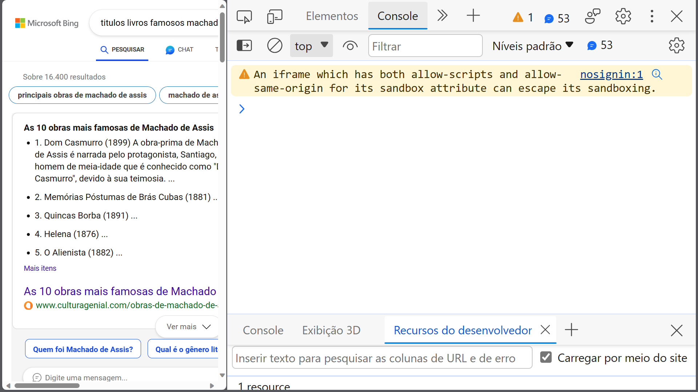

# Exercício Guiado

Bem-vindo ao seu primeiro exercício guiado na Residência Prática PU10. O propósito deste exercício é colocar em prática os conceitos abordados durante as aulas, promovendo uma compreensão mais profunda. Nosso objetivo é estimular questionamentos, incentivar o trabalho em equipe e facilitar a assimilação do conteúdo por meio dos pilares fundamentais da construção do conhecimento: 

- **Dados (Observação):** A base fundamental, onde a coleta de informações é crucial para o entendimento inicial.

- **Informação (Estruturação):** A organização dos dados, proporcionando uma estrutura que permita a análise e interpretação mais eficaz.

- **Conhecimento (Interpretação):** A capacidade de extrair significado da informação, conectando os pontos e construindo uma compreensão mais profunda.

- **Sabedoria (Justificação):** A habilidade de aplicar o conhecimento de maneira prática e fundamentada, promovendo uma tomada de decisão informada.

Ao mergulhar nesses pilares, esperamos que você não apenas adquira conhecimento, mas também desenvolva habilidades críticas e reflexivas. Este é um espaço para explorar, questionar e crescer como profissional. Estamos aqui para apoiar seu aprendizado e encorajamos a colaboração entre os participantes. Vamos começar este percurso juntos!

# Exercício Guiado 01 - Variáveis e Seus Tipos em Javascript (Parte 01)

Certifique-se de seguir este exercício guiado como se estivesse preparando uma receita de bolo; não deixe para bater os ovos depois de ter levado a massa ao forno! Siga cada passo conforme listado no exercício e não pule etapas.

## Objetivo do Exercício:

Neste exercício, você irá aprender a:

- **Diferenciar os tipos de variáveis e entender como e quando declará-las.**
- **Aprender a utilizar o console do navegador do seu computador.**

Mantenha-se atento aos detalhes e não hesite em fazer perguntas se algo não estiver claro. Vamos começar!

Visualize a seguinte situação: hoje marca o seu primeiro dia como monitor na biblioteca da escola, e a tarefa é registrar os nomes dos alunos que reservaram livros. Relembrando suas aulas de Javascript, você decide armazenar esses nomes no navegador do seu computador seguindo o padrão abaixo:
```javascript
const OPequenoPrincipe = "Francisco José";  // linha 01
const CemAnosDeSolidao = "Maria Conceição";   // linha 02
const DomCasmurro = "Maria Isabel";   // linha 03
const ARevolucaoDosBichos = "João Silva";  // linha 04
const CrimeECastigo = "Ana Oliveira";   // linha 05
const ORetratoDeDorianGray = "Pedro Alves";   // linha 06
const OGrandeGatsby = "Larissa Santos";   // linha 07
const OrgulhoEPreconceito = "Rafaela Pereira";   // linha 08
const MatarUmRouxinol = "Antônio Costa";   // linha 09
const OAlquimista = "Fernanda Lima";   // linha 10
const AMetamorfose = "Carlos Rocha";   // linha 11
const Fahrenheit451 = "Amanda Oliveira";   // linha 12
const OSenhorDosAneis = "Rodrigo Santos";   // linha 13
const OJardimSecreto = "Isabel Silva";   // linha 14
const OSilmarillion = "Lucas Almeida";   // linha 15
const OExterminadorDoFuturo = "Mariana Costa";   // linha 16
const OsMiseraveis = "José Pereira";   // linha 17
const AMeninaQueRoubavaLivros = "Camila Rocha";   // linha 18
const 1984 = "Vinícius Lima";   // linha 19
const CronicasDeNarnia = "Eduarda Santos";   // linha 20
```


Para realizar isso, você clica com o botão direito do mouse, seleciona a opção "Inspecionar" e, em seguida, acessa a aba "Console".



Digite cada linha do código Javascript e pressione a tecla Enter. O que aconteceu? O que foi exibido na tela do console?

Agora, no console, digite a chave da variável para o livro "O Bem-Amado", no caso, `OBemAmado`, e pressione Enter. O que aconteceu? Por que você acha que isso ocorreu? Qual é a justificativa para esse comportamento?

Prossiga testando o mesmo processo para os outros livros, seguindo a sequência. 


Uma semana após ter pegado emprestado o livro "O Bem-Amado", o aluno "Francisco José" devolve o livro e outro aluno, chamado "Allan José", pega o mesmo livro emprestado. O que você faria para atualizar o nome do aluno no seu navegador?

Teste:
```javascript
    var OBemAmado = "Allan José";
```

O que aconteceu? Que mensagem apareceu no console? Tente encontrar uma resposta para essa mensagem. O que faria para contornar esse problema?


-

-

-

-


Provavelmente, você já encontrou a resposta para esse problema. Agora, aplique essa mudança utilizando `var` e `let`, e faça os testes utilizando as duas chaves para variáveis.


# Exercício Guiado 01 - Variáveis e Seus Tipos em Javascript (Parte 02)

Conforme você estuda Javascript, suas habilidades em codificação melhoram, e agora você pretende implementar o que aprendeu no código que guarda as informações da biblioteca. Para isso, começa a refletir sobre o problema:

Você precisa guardar o nome dos alunos e as matrículas deles. Que tipo de variável utilizaria para armazenar o nome dos alunos? E para guardar o número da matrícula deles? José decidiu seguir o padrão:

```javascript
let nomeAluno01 = "Francisco José";
let matricula01 = 02010201;
```

Siga o padrão de José e faça a lista de nomes de alunos e matrículas baseados nos nomes dos alunos da primeira etapa do exercício guiado.

Após ter listado o nome e a matrícula de todos os alunos, digite no "Console":

```javascript
nomeAluno2002;
matricula2002;
```

O que apareceu? O que acha que aconteceu?

Digite:

```javascript
let nomeAluno2002;
let matricula2002;
```

Agora, digite no console essas mesmas variáveis. O que aconteceu?

Agora, digite:

```javascript
typeof nomeAluno15;
typeof matricula15;
```

O que apareceu? O que acha que aconteceu?

Para organizar melhor o código, José utiliza agora objetos para armazenar as informações de maneira organizada, seguindo o seguinte padrão:

```javascript
let aluno01 = { nome: "Francisco José", matricula: 235252 };
let aluno02 = { nome: "Maria Conceição", matricula: 2456262 };
```

Faça o mesmo e crie variáveis do tipo objetos para todos os alunos listados anteriormente. Após ter listado todos os alunos, execute o comando:

```javascript
aluno01.nome;
aluno01.matricula;
```

O que apareceu? O que isso significa?

Digamos que, além de nome e matrícula, agora você pretenda adicionar o livro que o aluno mantém emprestado. O que você pode fazer no objeto para atualizar essas informações?

Tente agora o seguinte:

```javascript
aluno01.livroEmprestado = "O Bem-Amado";
// Depois digite e pressione Enter
aluno01;
```

O que aconteceu? Qual seria a segunda forma de modificar essa informação? Aplique esse mesmo procedimento aos outros alunos.


As variáveis criadas até o momento têm o mesmo perfil de informações e servem para listar os alunos da biblioteca. Que tipo de variável poderia ser utilizada para organizar essas informações de uma maneira mais sucinta?

José resolveu então implementar o Array alunos da seguinte forma:
```javascript
    let alunos = []
    //Depois executou 
    alunos.push(aluno01)
    //E exibiu no console 
    alunos
```
O que aconteceu no script acima?O que você percebeu do método push()?
Aplique esse método a todos os alunos.
Ao final consulte no console o array alunos.

Agora, implemente um array estudantes como no script:
```javascript 
    const estudantes = []
```
Repita o mesmo procedimento do exercício anterior.
O que você concluiu disso? Qual é a diferença entre let alunos e const estudantes.


José, muito esperto, resolveu copiar a lista de estudantes da seguinte maneira.

```javascript
    const estudantes = alunos
    //Depois inseriu um novo aluno 
    estudantes.push({nome:"Ronaldo", matricula:2737828})
    //E comparou estudantes com alunos
    estudantes;
    alunos;
```
O que aconteceu?Por que isso aconteceu?Como isso poderia ser resolvido?

Tente:
```javascript
    const estudantes = [...alunos]
    //Depois insira um novo aluno
    estudantes.push({nome:"Ronaldo", matricula:2737828})
    //E compare estudantes com alunos
    estudantes;
    alunos;
```
O que aconteceu agora? Que técnica foi aplicada ?Isso pode se estender aos objetos?